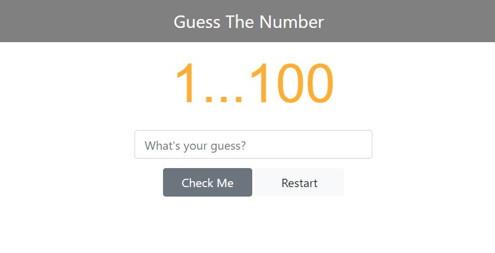

# Project Name

EDM BeatBox Project

## Table of Contents

- [Project Descripton](#project-description)
- [Screenshots](#screenshots)
- [How to Play](#how-to-play)
- [Technologies](#technologies)
- [Setup](#setup)
- [Status](#status)
- [Inspiration](#inspiration)
- [Learning Resources](#learning-resources)
- [Contact](#contact)

## Project Description

The Guess Number Game was build to apply my knowledge of learning Javascript, HTML and CSS. This games are created to enhance my capabilities on problem solving skills, coding structures and strings concept on Javascripts.

## Screenshots

## How to Play

You have to type numbers between 1 and 100, otherwise it will be notify for out of ranges and references, when you've hit the numbers, the results will shows and telling you that if you win or not.

Here the response you probably met.

- "Super Awesome! You got it in ... Guess" for 1x tries.
- "Yeay! You made it in ... Guesses" for 1 - 5 Guesses.
- "Nice! You got it in...GUesses " for 6 - 10 guesses.
- "Better later than never!" for up to 10 guesses.

You also can use "enter" to check the Guess and "Esc" to restart the Game

Check this out: [guessGame](https://nakullio.github.io/guessGame/)

## Technologies

- Hyper Text Markup Language (HTML)
- Cascading Style Sheets (CSS)
- Javascript

## Setup

- Text Editor (VS Code) and Compatible browser with Javascript, Html, and CSS

## Status

This exercise was no longer develop, and this is the last version.

## Inspiration

This project was inspired by Profit With Javascript Course module.

## Learning Resources

- Basic Design: Profit With Javascript Course Module
- CSS Setting: [W3School](https://www.w3schools.com/), [csstricks](https://css-tricks.com/)
- Sketch Drawer: draw.io
- Other: stackoverflow

## Contact

Created by Nakula Marvellio - feel free to contact me!
